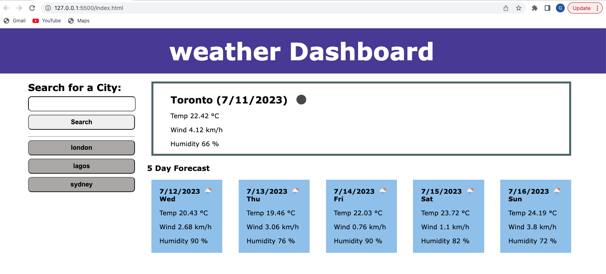

# weather-forecast

This is an application that helps to retrieve weather forecast data for cities using the Open Weather Map API.

- Search for current weather for a city by entering the city name
- Show 5 day forecast for the same city as well
- Display search history and remember search history in local storage

## Screenshots

## Links

* [GitHub](https://github.com/queendoescode/weather-forecast)

* [Deployed site](https://queendoescode.github.io/weather-forecast/)

## Third Party Resources used by this site

### APIs

* Open Weather Map (https://openweathermap.org/forecast5#5days)

### Images

None.
